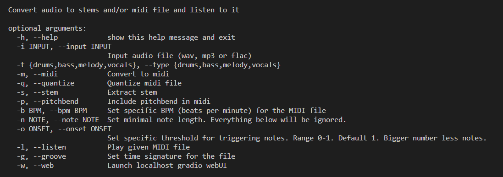

# MIDIfren 🎵 Audio Stem & MIDI Processor 🧠  

**Convert audio to stems to MIDI! Extract vocals, melody, bass, drums to midi with customizable settings!**  

---

### 💡 Features  
- **Supported fomats**: wav, mp3 and flac 🗣️ 
- **Usage**: Use in command-line 🖥️ or through Web UI 🌐 
- **Stem Separation**: Extract vocals, melody, drums, or bass from audio 🎙️  
- **BPM Detection**: Auto-detect tempo or set manually ⏱️  
- **MIDI Conversion**: Convert stems or audio to MIDI with adjustable sensitivity and pitchbend 📊  
- **Playback**: Listen to exported MIDI files instantly 🎹  
- **Quantization**: Align notes to 16th-note grids (or custom ticks) 🔧  
- **Maximum input file size**: 100MB 📢 

---
### 📦 Installation  
```bash
# python version >= 3.8
git clone or download this repo and unzip
cd MIDIfren/
pip install -r requirements.txt
```  
### 📦 Usage with UI
```bash
python MIDIfren.py --web
# Go to localhost:7860 to see the UI
```  


### 📦 Usage with terminal 
```bash
python MIDIfren.py -i <input_audio> -t <sound_type> [options]
```  


**Options**:  
- `-t, --type` : Choose type: `vocals`, `melody`, `drums`, `bass`  
- `-b, --bpm` : Set BPM (e.g., `120`) or skip this and MIDIfren will autodetect
- `-m, --midi` : Convert audio to midi  
- `-s, --stem` : Extract stem based on type selected 
- `-q, --quantize` : Quantize generated midi  
- `-p, --pitchbend` : Detect pitchbend  
- `-o, --onset` : Adjust note trigger sensitivity (0-1, default = 1)  
- `-g, --groove` : Set timesignature for drums e.g., '4/4' 
- `-l, --listen` : Play generated MIDI file or exported stem immediately 🎶  

---


### 📌 Examples  
```bash
# extract vocal stem from the audio and convert it to midi (with pitchbend) and listen to it
python MIDIfren.py -i input.wav -type vocals --stem --midi --pitchbend --listen
```  

```bash
# extract drums from audio and convert it to midi (with quantization) and listen to it
python MIDIfren.py -i input.wav -type drums --stem --midi --quantize --listen
```  

```bash
# extract bass stem from audio file and listen to it
python MIDIfren.py -i input.wav -type bass --stem --listen
```  

```bash
# convert audio file to midi directly and listen (no stem extraction)
python MIDIfren.py -i input.wav -type drums --midi --listen
``` 

---
**Output**:  

Midi files, sonified midi and stems will be in the output folder.
- `output/drums.wav` (stem)  
- `output/drums.mid` (MIDI)  
- ...

---
**Note**:

- All audio is automatically normalized and trimmed for silence before processing.

---  


**Made by Omodaka9375 with ❤️ for audio enthusiasts & music devs!** 🎶
